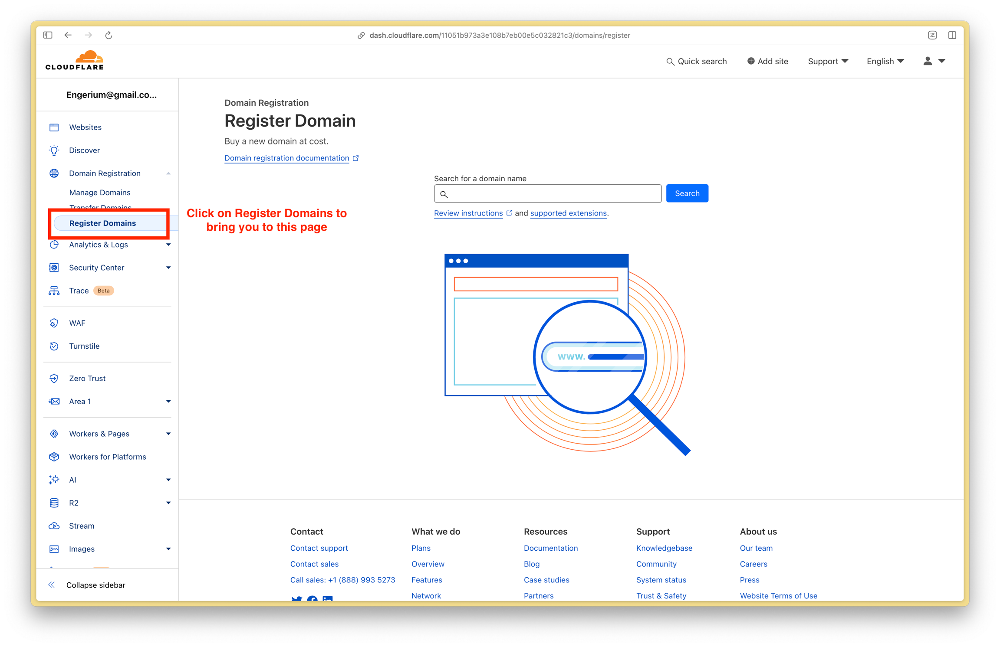
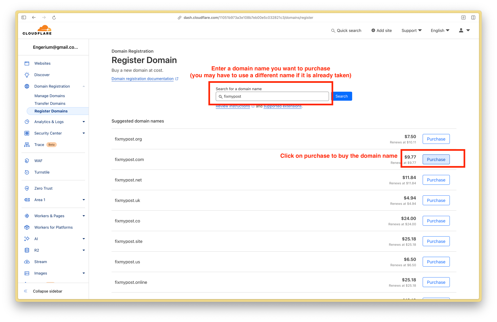
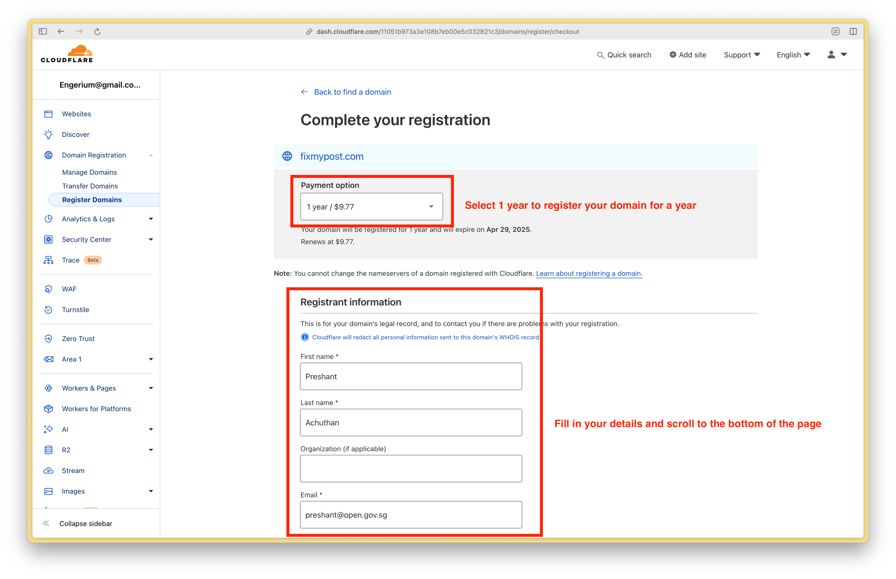
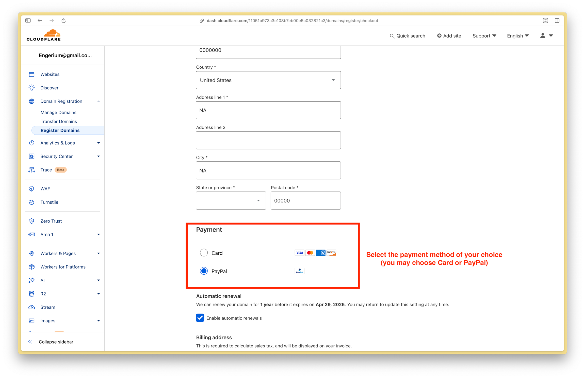
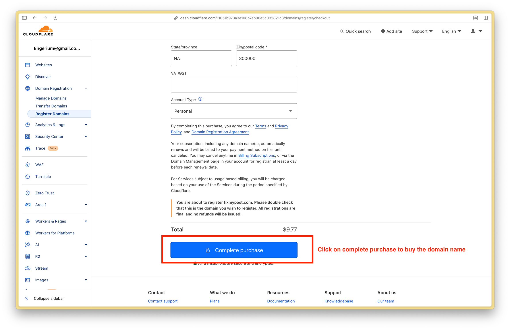
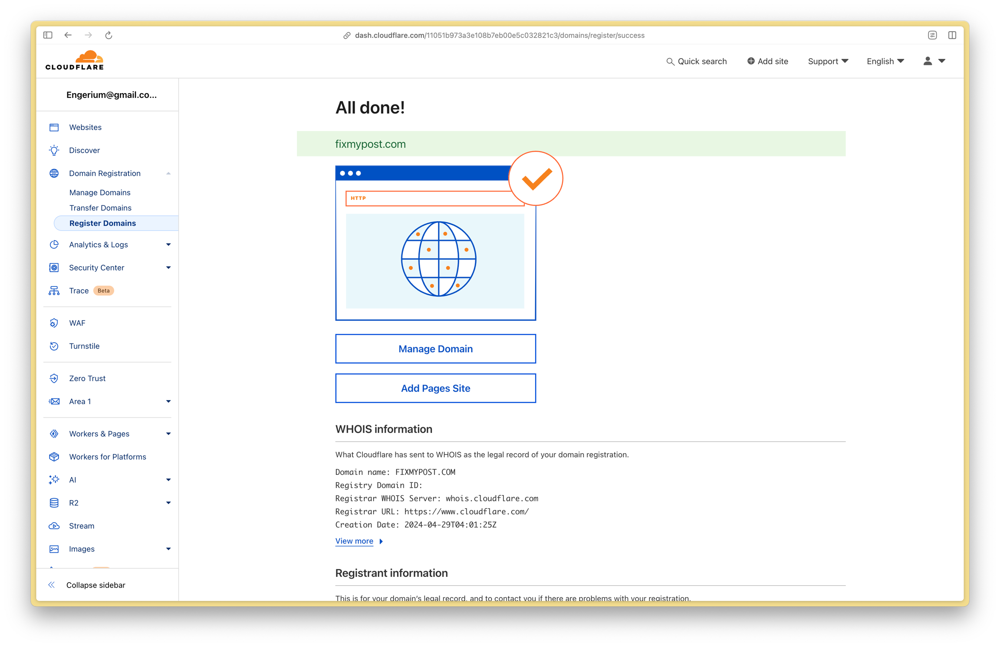

# Cloudflare

### Creating a Cloudflare account

Follow the instructions in this page below to create your Cloudflare account.



### Registering a Domain Name (also known as buying a domain name)

#### 1. Login to Cloudflare Dashboard ([dash.cloudflare.com](https://dash.cloudflare.com/)) and click on Register Domains in the sidebar

<figure><figcaption>
Click on Register Domains to bring you to this page
</figcaption></figure>

### 2. Type in a domain name of your choice and click purchase

<figure><figcaption>
Enter a domain name and click on purchase
</figcaption></figure>

#### 3. Select a 1 year registration and fill in your registrant information

<figure><figcaption>
Select 1 year and fill in the registrant information section
</figcaption></figure>

#### 4. Select the payment method of your choice

<figure><figcaption>
Select your payment method
</figcaption></figure>

#### 5. Click on Complete Purchase to buy your domain name

<figure><figcaption>
Click on complete purchase
</figcaption></figure>

#### 6. Congrats you've just purchased your domain name!

<figure><figcaption>
You should see this screen once you have purchased your domain name
</figcaption></figure>

### Linking my domain name to my web app (using the Sample Web App as an example)


You should have already set up your Sample Web App before linking your domain name. If you have yet to do so, please follow the instructions [here](sample-web-app.md).


To link your domain name to the sample web app, there are three things you will need to do:

* Enable full SSL/TLS encryption on Cloudflare
* Setup Render to use a custom domain name for your Sample Web App
* Setup Cloudflare's DNS to point to the Sample Web App deployed on Render

#### 1. Go to Cloudflare Dashboard ([dash.cloudflare.com](https://dash.cloudflare.com/)) and click on the domain name you purchased

<figure><figcaption>
Click on your domain name
</figcaption></figure>

#### 2. Click on the SSL/TLS tab in the sidebar

<figure><figcaption>
Click on the SSL/TLS tab in the sidebar
</figcaption></figure>

#### 3. Set the SSL/TLS encryption mode to Full

<figure><figcaption>
Select Full to change SSL/TLS encryption mode
</figcaption></figure>

<figure><figcaption>
Click on Confirm to continue
</figcaption></figure>

<figure><figcaption>
Your SSL/TLS encryption mode should now be set to full
</figcaption></figure>

#### 4. Go to Render Dashboard ([dashboard.render.com](https://dashboard.render.com/)) and click on your web app (in this example the sample web app is selected)

<figure><figcaption>
Select your web application on Render
</figcaption></figure>

#### 5. Click on Settings to Add a Custom Domain Name

<figure><figcaption>
Click on Settings
</figcaption></figure>

<figure><figcaption>
Scroll down to the section on custom domains
</figcaption></figure>

<figure><figcaption>
Enter your domain name and click save
</figcaption></figure>

<figure><figcaption>
You should see something similar, click on the copy icon to copy the onrender.com URL which will be used for the nest step
</figcaption></figure>

#### 6. Go to Cloudflare Dashboard ([dash.cloudflare.com](https://dash.cloudflare.com/)) and click on your domain name

<figure><figcaption>
Click on your domain name
</figcaption></figure>

#### 7. Click on DNS to go to the page to edit your DNS Records, then click on Add Record

<figure><figcaption>
Click on DNS in the sidebar then click on Add Record
</figcaption></figure>

#### 8. Add a new DNS Record

<figure><figcaption>
Add a new CNAME record with the Target being the onrender.com URL you copied earlier in Step 5, then click Save
</figcaption></figure>

#### 9. Go back to your Render Dashboard and click on Verify

<figure><figcaption>
Click on Verify
</figcaption></figure>

<figure><figcaption>
It may take some time for the domain to be verified and for a certificate to be automatically generated
</figcaption></figure>

<figure><figcaption>
Congrats! You have now set up a custom domain name for your app!
</figcaption></figure>
