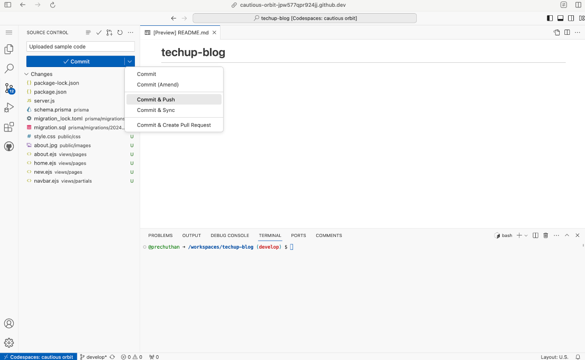

# 📲 Building a Sample Web App

### 1. Create a new GitHub Repository

* Go to [https://github.com/new](https://github.com/new) to create a new repository
* Type in your own repository name (this could be any name)
* The description for your repository can be empty
* Your repository should by default be Public
* Ensure that you check the "**Add a README file**"
* Ensure that you select **Node** as the .gitignore template
* The license can be at it's default setting of None
* Note that your default branch may be called "master" or "main", this is okay and you can leave it (mine is currently set as "develop").
* Click on "Create repository" to create your new GitHub Repository

<figure><figcaption>
A sample of the options selected before clicking "Create repository"
</figcaption></figure>

### 2. Open your newly created repository in Codespaces

* You should have been re-directed to your newly created repository
* Click on the green "Code" button, select the "Codespaces" tab and click **"Create Codespace on develop"**. (Note: your branch may be called "master" or "main" and this is fine)

<figure><figcaption>
Click on create codespace to open up codespaces for your repository
</figcaption></figure>

### 3. Download the source code and unzip the file

* Your GitHub Codespace should have opened up in a new tab after creating a codespace in the previous step.

#### Click on the link below to download the source code for the sample app here and unzip the file:



<figure><figcaption>
You should see the following files and folders after unzipping the zip file
</figcaption></figure>

### 4. Drag and drop sample app code into Codespaces

* After completing Step 2, a new tab should have opened with your Codespace similar to the image shown below.

<figure><figcaption>
Your Codespace for your newly created GitHub repository
</figcaption></figure>

* Drag and drop all files and folders in Step 3 into the sidebar of your Codespace. IMPORTANT: Ensure that you select all the files and folders INSIDE the unzipped file, do not upload the whole zip file (see the below images if you are unsure).

<figure><figcaption>
Select all the files and folders INSIDE the unzipped file to upload to Codespace
</figcaption></figure>

<figure><figcaption>
Drop the selected folders and files in the section marked by the red box
</figcaption></figure>

<figure><figcaption>
Ensure you drag and drop the correct files in the right location
</figcaption></figure>

* This uploads the sample web app source code to your Codespace
* After dragging and dropping, your Codespace should look like this with the following files in the sidebar

<figure><figcaption>
Note the newly added folders of "prisma", "public", "views" and files "package-lock.json", "package.json", "server.js"
</figcaption></figure>

### 5. Commit & Push to your repository

* Click on the Source Control icon (the icon which has blue numbers on it, in the image above it's the third tab on the left)
* Enter a commit message of "Uploaded sample code"
* Click on the dropdown next to "Commit" and click on "Commit & Push".
* Note that you will have to click on the drop down arrow for "Commit & Push" to show up

<figure><figcaption>
Click on the Source Control tab, write a commit message and click on "Commit &#x26; Push" from the drop down list
</figcaption></figure>

* If the following pop-up appears, select "Always"

<figure><figcaption>
Select "Always" should this pop-up appear after clicking "Commit &#x26; Push"
</figcaption></figure>

* Another pop up may appear at the bottom right of your screen, select the option of "Yes"

<figure><figcaption>
Select "Yes" should this pop-up appear on the bottom right of your screen
</figcaption></figure>

* Check that your files are in your GitHub repository by going to https://github.com and selecting the repository you created in Step 1

<figure><figcaption>
Select your repository in the sidebar on the left
</figcaption></figure>

* You should now see that there are the newly uploaded files in this repository

<figure><figcaption>
The files should now be in your repository you created
</figcaption></figure>

### 6. Create a new PostgreSQL database on Render

* Go to [https://dashboard.render.com/new/database](https://dashboard.render.com/new/database) to create a new PostgreSQL database on Render.
* Type in a Name for your PostgreSQL instance (I've named mine techup-sample-database)
* Leave the Database field blank
* Leave the User field blank
* Change the Region to "Singapore (Southeast Asia)
* Leave PostgreSQL Version as the default value of 16
* Leave the Datadog API Key field blank
* Change your instance type to FREE
* Click on "Create Database"

<figure><figcaption>
Enter a Name for your instance and change the Region to Singapore while leaving other fields as their default values
</figcaption></figure>

<figure><figcaption>
Change your Instance Type to FREE before clicking on Create Database
</figcaption></figure>


Note that, at this step, you may be asked to enter your **credit card details** to verify your identity; without which, you cannot proceed.&#x20;

We would recommend that you proceed to do so. For the programme, you should not be incurring any expenses from the use of Render, as we will be using the **free plan** by default. That said, should you be using a paid plan for improved functionality, you should also be able to claim for reimbursement, as each participant has been [allocated a $100 budget](../pre-work/tooling-and-software/tooling-claims-instructions.md) for tooling purposes.&#x20;


* Your database should now be created (after about 30 seconds)
* Scroll down to the section on Connections and take note of the `External Database URL`
* Copy this `External Database URL` to a blank word document (or anywhere else such as Notepad) as you will be using it later to add it as an environment variable.
* **IMPORTANT: PLS ENSURE YOU HAVE COPIED THIS URL AS YOU NEED IT LATER.**

<figure><figcaption>
Click on "Copy to clipboard" for the External Database URL to copy this URL for use later
</figcaption></figure>

### 7. Create a new Web Service on Render

* Go to [https://dashboard.render.com/create?type=web](https://dashboard.render.com/create?type=web) to create a new Web Service (alternatively you may also click on the purple New + button at the top of the page and select Web Service)
* Ensure "Build and deploy from a Git repository" is selected then click Next

<figure><figcaption>
Ensure the first option of "Build and deploy from a Git repository" is selected
</figcaption></figure>

* On the right column you will need to click on "+ Connect Account" to connect your GitHub account to Render.
* Click on "Connect" for the repository name which your created in Step 1

<figure><figcaption>
Click Connect on the repository created in Step 1 (if this dropdown list is not showing you will need to click on + Connect Account on the page to connect your GitHub account to Render)
</figcaption></figure>

* Leave the Name field as it's default value
* Ensure that the Region is set to "Singapore (Southeast Asia)"
* Ensure that your Branch is selected (yours may be called "master" or "main")
* Leave the Root Directory field blank
* Leave the Runtime as "Node"
* Change the Build Command to `yarn; npx prisma db push; npx prisma generate`

<figure><figcaption>
Change the Build Command to as shown above
</figcaption></figure>

* Add the Start Command of `node server.js`
* Change the Instance Type to FREE

<figure><figcaption>
Add the Start Command to "node server.js" and change the Instance Type to FREE
</figcaption></figure>

* Add a new Environment Variable of name `DATABASE_URL` with the value of your copied `External Database URL` in Step 6. _(If you have misplaced this URL, not to worry. Go to_ [_https://dashboard.render.com/_](https://dashboard.render.com/) _and click on your database. Scroll down and simply copy the External Database URL again.)_

<figure><figcaption>
Create a new Environment Variable of "DATABASE_URL" and paste the External Database URL copied earlier as its value
</figcaption></figure>

* Click on the "Create Web Service" button to start deploying
* You will be redirected to a new page which shows the logs of the server build happening. It would take approximately 2-4mins for the the server to full deploy your app.
* Your app is deployed once you see the line "==> Your service is live 🎉" in the logs.

<figure><figcaption>
Your app is ready once you see "Your service is live 🎉"
</figcaption></figure>

### 8. Accessing your newly deployed web application

* At the top of the same deploy page with the logs, you will see a URL (in my case it is [https://techup-blog.onrender.com](https://techup-blog.onrender.com/)). Click on this link and it will bring you to your web application.

<figure><figcaption>
Click on the URL at the top left to bring you to your newly deployed web app
</figcaption></figure>

* You should now be able to view the sample web app which you have deployed on your own Render server!

<figure><figcaption>
Congrats!! You have successfully deployed the sample web app on your own Render server
</figcaption></figure>

* Have fun playing around with the sample web app by Adding and Deleting blog posts!

## Optional: How do I view what is inside my Postgres database which I created on Render.com?

#### 1. Download and install TablePlus from [https://tableplus.com/](https://tableplus.com/)

<figure><figcaption>
Dowload TablePlus for Mac or TablePlus for Windows depending on what laptop you have
</figcaption></figure>

#### 2. Open TablePlus and click on the + icon to add a new connection

<figure><figcaption>
Click on the + icon to add a new connection
</figcaption></figure>

#### 3. Click on Import from URL

<figure><figcaption>
Click on Import from URL
</figcaption></figure>

#### 4. Paste the `External Database URL` (which you copied earlier when setting up Postgres) into the text field then click Import

<figure><figcaption>
Paste your External URL into the field then click Import
</figcaption></figure>

#### 5. Click on Connect (you may rename the "Name" field or leave it as it's default)

<figure><figcaption>
Click on connect
</figcaption></figure>

#### 6. You have now successfully connected to the database from TablePlus and you may click on the Post table in the left sidebar to view the contents

<figure><figcaption>
Success! You can click on the Post table to view the contents
</figcaption></figure>
