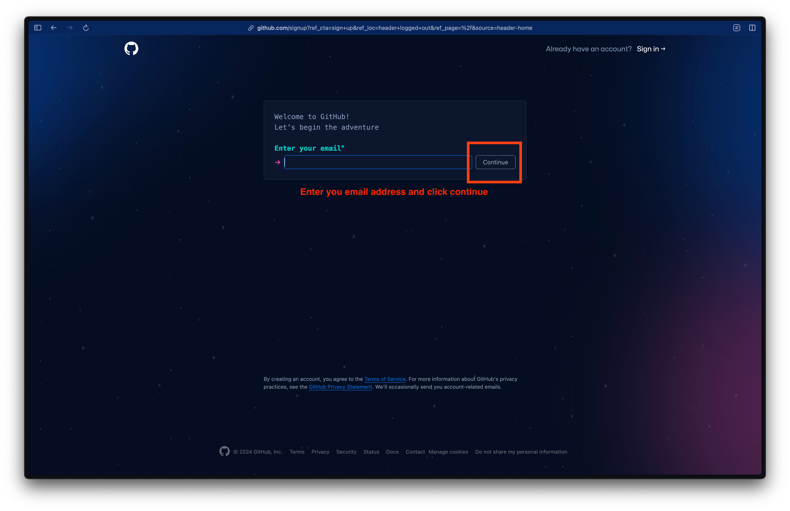
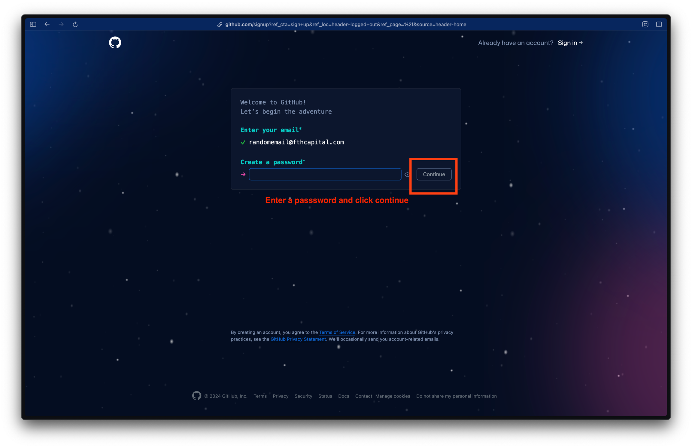
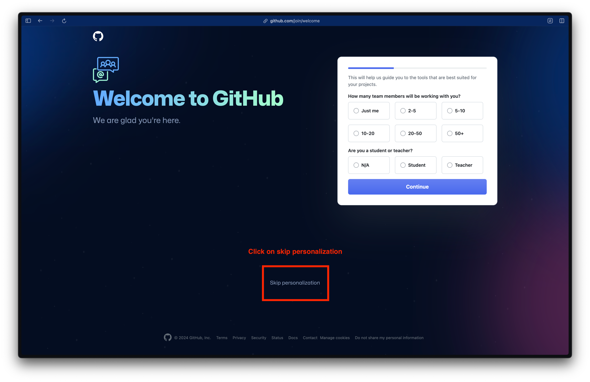
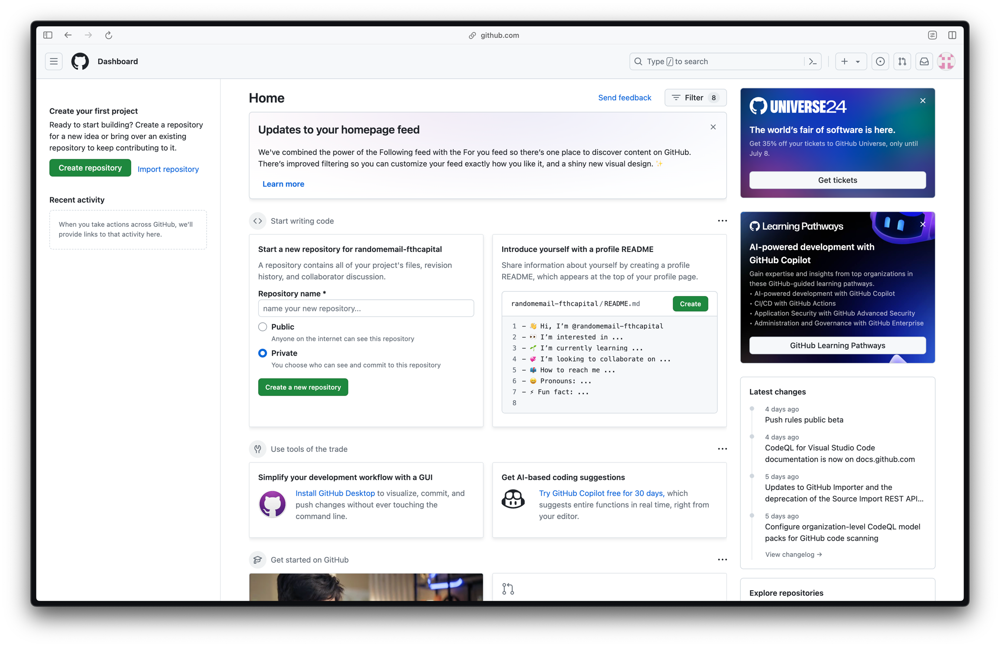

# GitHub

Creating a GitHub account

1\. Go to [https://github.com](https://github.com/) and click on Sign Up

<figure><figcaption>
Click on the Sign Up button
</figcaption></figure>

#### 2. Enter your email address

<figure><figcaption>
Enter your email address and click continue
</figcaption></figure>

#### 3. Create a password

<figure><figcaption>
Enter a password and click continue
</figcaption></figure>

#### 4. Enter a username of your choice

<figure><figcaption>
Enter a username and click continue
</figcaption></figure>

#### 5. Select your email preferences

<figure><figcaption>
Select your email preferences and click continue
</figcaption></figure>

#### 6. Complete the human verification puzzle

<figure><figcaption>
Complete the puzzle to verify that you are human
</figcaption></figure>

#### 7. Verify your email with the code sent to your email address

<figure><figcaption>
Verify your account by typing in the code sent to your email
</figcaption></figure>

#### 8. Skip Personalisation

<figure><figcaption>
Skip personalisation
</figcaption></figure>

#### 9. Congrats! You now have a GitHub account created!

<figure><figcaption>
🎉 You now have a GitHub account!
</figcaption></figure>

