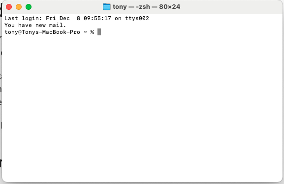
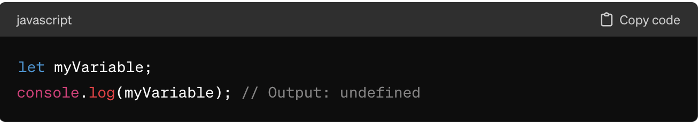

# ✏️ Frequently Asked Questions

### Attendance <a href="#attendance" id="attendance"></a>

* **I cannot attend the programme on some days. What should I do?** \
  \
  If you need to be excused from any part of the programme (in part or full due to valid reasons), please get your RO’s approval in writing and include your reason for absence. Please also copy your agency POC / HR, TechUp Main Facilitator from GovTech \[Patrick Pang ([patrick\_pang@tech.gov.sg](mailto:patrick\_pang@tech.gov.sg))] and TechUp team members from GovTech \[Jeanette Tan ([jeanette\_tan@tech.gov.sg](mailto:jeanette\_tan@tech.gov.sg))] and Yanting Tong ([Tong\_Yanting@tech.gov.sg](mailto:Tong\_Yanting@tech.gov.sg)).\

* **I have urgent work I need to clear during the programme.** \
  \
  If you need to be excused from any part of the programme (in part or full due to valid reasons), please get your RO’s approval in writing and include your reason for absence. Please also copy your agency POC / HR, TechUp Main Facilitator from GovTech \[Patrick Pang ([patrick\_pang@tech.gov.sg](mailto:patrick\_pang@tech.gov.sg))] and TechUp team members from GovTech \[Jeanette Tan ([jeanette\_tan@tech.gov.sg](mailto:jeanette\_tan@tech.gov.sg))] and Yanting Tong ([Tong\_Yanting@tech.gov.sg](mailto:Tong\_Yanting@tech.gov.sg)).\
  \
  If you appear to be doing work during the programme without prior clearance/approval, Patrick Pang, your Reporting Officer, and your HR POC will be notified.​

### Others <a href="#others" id="others"></a>

* **Who should I approach if I need help?**

You may try these methods here for self-help or peer-help.

o   TechUp Website

o   Slack Help Channels (#techup-webapp-help for web app related issues, #techup-admin-help for all other general issues)

If all else fails, you may reach out to the following representatives via email or Slack:

o   Jeanette Tan at [Jeanette\_Tan@tech.gov.sg](mailto:Jeanette\_Tan@tech.gov.sg)

o   Yanting Tong at [Tong\_Yanting@tech.gov.sg](mailto:Tong\_Yanting@tech.gov.sg)

### Problem Statement <a href="#problem-statement" id="problem-statement"></a>

*   **What if I don’t have a problem statement?**

    There are plenty of problems to solve! 🙂 Just look around and see what is bothering you or someone around you in your daily lives. A simple guide to start crafting a problem statement can be found [here](https://www.build.gov.sg/problem-statement-guide/).
*   **Can I change my problem statement halfway?**

    Yes, as long as you are able to build your solution in time for the web app presentation on 19 and 20 Nov 2024.
*   **Does my web app need to solve a problem? What kind of problem?**

    Yes, the deliverable for TechUp is to build your own web app (frontend)  that solves a problem of your choice. The web app you build should meet the requirements below:


1. Articulate a user problem
2. Use CSS to design and style page
3. Interactivity with Javascript
4. Intuitive UX flow
5. Reading and writing into a database (optional)


*   **How can I find inspiration on what type of webapp to build?**

    You may find inspiration on the webapps built by our previous run of TechUp participants [here](https://techup.live/).

    Alternatively, you can follow the step-by-step tutorials below for additional practice:


<table data-view="cards"><thead><tr><th></th><th></th><th></th></tr></thead><tbody><tr><td><p><strong>Making a To-do List with EJS:</strong></p><p><a href="https://appbrewery.com/courses/legacy-complete-web-development-course/lectures/46570380">App Brewery Section 22</a></p></td><td></td><td></td></tr><tr><td><strong>Sample Web app tutorials:</strong> <a href="https://www.youtube.com/watch?v=G0jO8kUrg-I&#x26;t=1398s">To-do list</a> and <a href="https://www.youtube.com/watch?v=PBcqGxrr9g8">Quiz app</a></td><td></td><td></td></tr><tr><td></td><td></td><td></td></tr></tbody></table>

### Technical

#### Overview on Web Development <a href="#overview-on-web-development" id="overview-on-web-development"></a>

* **What is a static vs dynamic website?**

|                    | Static Website                                                                                                                                                                                                            | Dynamic Website                                                                                                                                                                        |
| ------------------ | ------------------------------------------------------------------------------------------------------------------------------------------------------------------------------------------------------------------------- | -------------------------------------------------------------------------------------------------------------------------------------------------------------------------------------- |
| Definition         | A static website displays the same content to all visitors in the same format. It is made up of a fixed number of pre-built files stored on a web server, and content won’t change unless the HTML source code is edited. | A dynamic website presents different information to different visitors (depending on their location, local time & preferences), making for a more tailored and interactive experience. |
| Scripting Language | Files are written in HTML, CSS, and JavaScript, which are called “client-side” languages because they execute in the user’s web browser.                                                                                  | To build pages on the back end, dynamic websites employ “server-side” languages like PHP, Python, Ruby, & JavaScript, in addition to “client-side” languages.                          |
| Database           | Does not interact with a database.                                                                                                                                                                                        | May interact with databases to store and retrieve dynamic content.                                                                                                                     |
| Examples           | Brochure websites, personal blogs, portfolio sites, school websites (e.g. [https://www.nanhuapri.moe.edu.sg/](https://www.nanhuapri.moe.edu.sg/))                                                                         | Facebook, Netflix, Twitter, Youtube, Gmail                                                                                                                                             |
| Use case           | Static websites work best for sites with fewer pages that don’t require frequent updates or changes. (E.g company webpages)                                                                                               | Dynamic websites are those which are content heavy and user-driven. (E.g. real estate listing websites)                                                                                |


Read more here:

[https://blog.hubspot.com/website/static-vs-dynamic-website](https://blog.hubspot.com/website/static-vs-dynamic-website)

[https://www.wix.com/blog/static-vs-dynamic-website](https://www.wix.com/blog/static-vs-dynamic-website)


* **What is the difference between a website vs a web app?**

|            | Website                                                                                                                               | Web Application                                                                                                                                                                                                                                                                                                             |
| ---------- | ------------------------------------------------------------------------------------------------------------------------------------- | --------------------------------------------------------------------------------------------------------------------------------------------------------------------------------------------------------------------------------------------------------------------------------------------------------------------------- |
| Function   | Websites serve to inform users. The content on a website can be viewed, read, or listened to, but the user cannot manipulate it.      | Web apps serve to help users. The content on web apps is not only viewable but allows users to manipulate data. Anything on the Internet that performs a service is likely a web app.                                                                                                                                       |
| Complexity | Websites are just a collection of static web pages.                                                                                   | While web apps can be built with the same web technologies as websites (JavaScript, HTML, and CSS), apps will also need to use more advanced programming languages (like PHP, frameworks, and server-side scripts). Additionally, UX/UI design is more crucial to web applications since users actively interact with them. |
| Access     | Public access is a hallmark of websites.                                                                                              | Web apps frequently require user authentication because they provide services customised to the user’s requirements.                                                                                                                                                                                                        |
| Use case   | If you want users to get to know your business and the products or services you offer, a website is probably the best choice for you. | If you want to provide a service to users, you will want to develop a web application.                                                                                                                                                                                                                                      |


Read more here:

[https://www.koombea.com/blog/website-vs-web-application/](https://www.koombea.com/blog/website-vs-web-application/)


*   **What are the common frameworks used in tech companies? Do they actually use HTML, CSS, JS, Node.js?**

    HTML, CSS, JavaScript are foundational technologies that are still widely used. HTML for structuring web content, CSS for styling, and JavaScript for adding interactivity and dynamic behavior to web pages. Below are some common frameworks:

<details>

<summary>Frontend Frameworks</summary>

* React.js: Developed by Facebook, it's widely used for building user interfaces, particularly for single-page applications.
* Angular: Developed and maintained by Google, Angular is a comprehensive framework for building web applications.
* Vue.js: Known for its simplicity and ease of integration, Vue.js is increasingly popular for building interactive web interfaces.

</details>

<details>

<summary>Backend Frameworks</summary>

* Node.js: Though not exactly a framework, Node.js is a runtime environment that allows you to run JavaScript on the server-side. Many frameworks are built on top of it, such as Express.js.
* Express.js: A minimal and flexible Node.js web application framework, often used for building APIs and web servers.
* Django: Written in Python, Django is a high-level web framework that encourages rapid development and clean, pragmatic design.

</details>

<details>

<summary>Database Frameworks</summary>

* MongoDB: A NoSQL database, often used with Node.js and Express.js for full-stack JavaScript applications.
* MySQL/PostgreSQL: Relational databases that are commonly used in conjunction with various backend frameworks.

</details>

<details>

<summary>Mobile Development</summary>

* React Native: A framework for building mobile applications using React, allowing developers to write code once and deploy it on both iOS and Android platforms.
* Flutter: Developed by Google, Flutter is a UI toolkit for building natively compiled applications for mobile, web, and desktop from a single codebase.

</details>

### Getting Started <a href="#getting-started" id="getting-started"></a>

*   **What is the Terminal / Command line?**

    The terminal is a software application that provides access to the command line interface. It's a graphical application that emulates a text-based terminal.

    The command line is the literal line where you enter commands and the cursor blinks.

`Windows - Command Prompt`

<figure><figcaption></figcaption></figure>

```
Mac - Terminal
```


<figure><figcaption></figcaption></figure>


Read more here: [https://developer.mozilla.org/en-US/docs/Learn/Tools\_and\_testing/Understanding\_client-side\_tools/Command\_line](https://developer.mozilla.org/en-US/docs/Learn/Tools\_and\_testing/Understanding\_client-side\_tools/Command\_line)


*   **What is localhost?**

    In the context of web development, developers use "localhost" to refer to the local web server running on their own computer. They can develop and test web applications locally before deploying them live to a remote server.

    This means that other devices on the same network or on the internet cannot directly access web pages hosted on localhost, as it resolves to the loopback IP address (usually 127.0.0.1), which is reserved for communication within the same device.

<figure><figcaption></figcaption></figure>


Read more here: [https://blog.hubspot.com/website/what-is-localhost](https://blog.hubspot.com/website/what-is-localhost)


### Javascript <a href="#javascript" id="javascript"></a>

* **What is the difference between null and undefined in javascript?**

\-> null is typically used as a placeholder to indicate that a variable or object property does not currently have a value, or that a function returns no meaningful result.

<figure><figcaption></figcaption></figure>

\-> undefined typically indicates a variable that has been declared but has not been assigned any value, or an object property that does not exist.

<figure><figcaption></figcaption></figure>

### Deployment <a href="#deployment" id="deployment"></a>

*   **Can I use other platforms to deploy the web app, e.g. Netlify, GitHub Pages?**

    We encourage participants to use **Render** as the hosting platform, so that all the tooling is standardized and we can help troubleshoot issues with less complexity.
*   **Why am I encountering an error when deploying on Render?**

    Check whether you have copied your external database url correctly.

    Troubleshoot using ChatGPT - paste the error message there.
