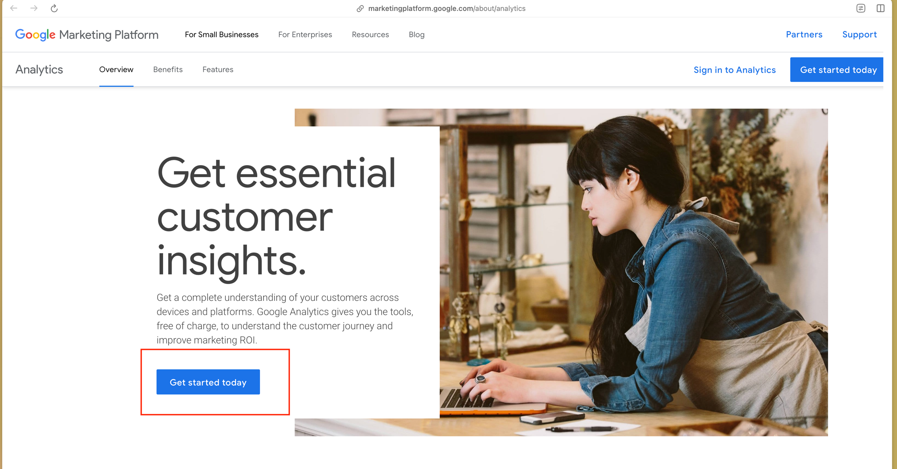
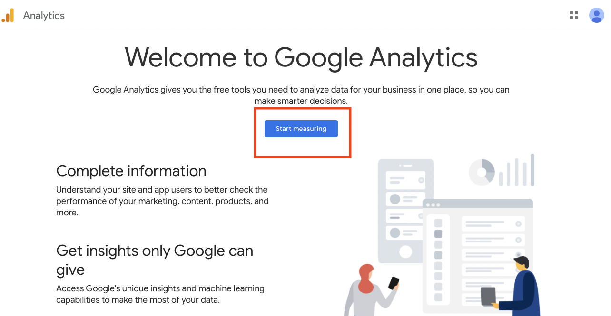
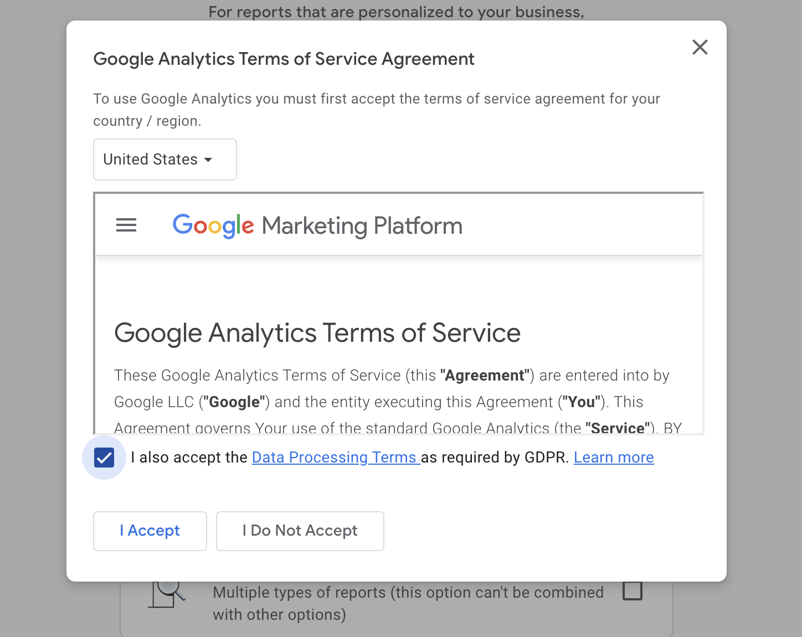

# Google Analytics


Setting up Google Analytics is extremely simple, all you need to do is to:

* Generate a Google Tag (just some JavaScript code)
* Copy this Google Tag in the \<head> section of every page you want to track


### How to Set Up Google Analytics

#### 1. Go to [https://marketingplatform.google.com/about/analytics/](https://marketingplatform.google.com/about/analytics/) and click on Get Started Today

<figure><figcaption></figcaption></figure>

#### 2. After logging in to your Google Account, you will be redirected to the Setup page, click on Start Measuring

<figure><figcaption></figcaption></figure>

#### 3. Enter an account name then click next

<figure><figcaption></figcaption></figure>

<figure><figcaption></figcaption></figure>

#### 4. Enter a property name (and Singapore timezone and currency is selected) then click next

<figure><figcaption></figcaption></figure>

#### 5. Select Other Business Activities and Small then click Next

<figure><figcaption></figcaption></figure>

#### 6. Select Examine User Behaviour then click Create

<figure><figcaption></figcaption></figure>

#### 7. Accept the Terms and click next

<figure><figcaption></figcaption></figure>

#### 8. Select Web

<figure><figcaption></figcaption></figure>

#### 9. Enter your website URL and enter the stream name, then click create stream

<figure><figcaption></figcaption></figure>

#### 10. The installation instruction should pop-up automatically after approx 10-20 seconds, click on Install Manually and copy the Google tag

<figure><figcaption></figcaption></figure>

#### 11. Finally, you will need to place this Google tag in ALL your HTML/EJS pages in the

<figure><figcaption></figcaption></figure>

#### 12. Remember to Commit and Push your changes to the repository once you are done!
