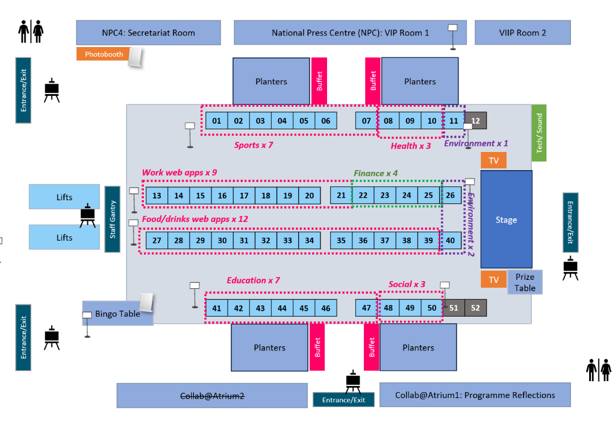

# 🏆 Demo Day

### About TechUp Demo Day

TechUp Demo Day 2024 is a day to celebrate the creativity of all of you – as you unveil your web apps – developed from scratch to tackle real-world challenges. Hear the stories of your programme mates, and explore the meaningful solutions that you have designed.

### Event Details

<table><thead><tr><th width="146"></th><th></th></tr></thead><tbody><tr><td>Event Title:</td><td>TechUp Demo Day 2024</td></tr><tr><td>Event Date:</td><td>22 Nov 2024</td></tr><tr><td>Event Time:</td><td>1.00PM to 4.00PM</td></tr><tr><td>Event Venue</td><td>
Ministry of Digital Development and Information 140 Hill Street #01-01A, Old Hill Street Police Station

Singapore 179369 (View map <a href="https://safe.menlosecurity.com/https:/www.google.com/maps?q=140+Hill+Street+#01-01A+Old+Hill+Street+Police+Station+Singapore+179369">here</a>)
</td></tr><tr><td>Dress Code:</td><td>TechUp t-shirt + anything decent below</td></tr><tr><td>Event Organisers:</td><td>TechUp Run 3 organised by GovTech Digital Academy in partnership with Open Government Products and in support of Smart Nation Singapore.</td></tr></tbody></table>

### Demo Day 2024 Programme

<table><thead><tr><th width="167">Time</th><th width="383">Item</th><th>Venue</th></tr></thead><tbody><tr><td>10.30AM</td><td>Programme Reflections with TechUp Participants</td><td>
<strong>MDDI</strong>

Collab Rm 1 (LG 1 – 4)

#01-06 (LG 5 – 10)
</td></tr><tr><td>11.30AM</td><td>Set up your booths &#x26; fill in your own personal flyer</td><td>MDDI Atrium</td></tr><tr><td>12.00PM</td><td>Lunch</td><td>MDDI Atrium</td></tr><tr><td>1.00PM</td><td>Web App Presentations by TechUp Participants</td><td>MDDI Atrium</td></tr><tr><td>1.30PM</td><td>Arrival of PS, DS and GCDTO + Demo’s ongoing</td><td>MDDI Atrium</td></tr><tr><td>2.00PM</td><td>Showcase of Top 8 Web Apps  (Lightning Demos) x 2 mins each</td><td>MDDI Atrium</td></tr><tr><td>2.30PM</td><td>Prize Presentations by PS Joseph Leong Permanent Secretary, MDDI, Smart Nation and Cybersecurity</td><td>MDDI Atrium</td></tr><tr><td>2.45PM</td><td>Closing Remarks by PS Joseph Leong</td><td>MDDI Atrium</td></tr><tr><td>2.55PM</td><td>Group Photo Taking</td><td>MDDI Atrium</td></tr><tr><td>3.00PM</td><td>Tea break and networking</td><td>MDDI Atrium</td></tr><tr><td>4.00PM</td><td>Event ends</td><td>MDDI Atrium</td></tr><tr><td></td><td>Return laptops</td><td>Collab Rm 1</td></tr></tbody></table>

<figure><figcaption></figcaption></figure>

### Booth Layout:

The Demo Area will arrange booths by web app category, so similar projects - such as food and drink web apps - will be grouped together wherever possible. We appreciate your understanding that, due to the unique nature of some web apps, certain booths may be placed based on available space.

**Do watch this space to confirm your booth numbers based on your name.**

<table><thead><tr><th>Name</th><th>Booth No.</th><th>Category</th><th data-hidden></th><th data-hidden></th></tr></thead><tbody><tr><td>Adrian Tang</td><td>1</td><td>Sports</td><td>Participant</td><td>Require booth</td></tr><tr><td>Ernest</td><td>2</td><td>Sports</td><td>Participant</td><td>Require booth</td></tr><tr><td>Lawrence Seng</td><td>3</td><td>Sports</td><td>Participant</td><td>Require booth</td></tr><tr><td>Majella</td><td>4</td><td>Sports</td><td>Participant</td><td>Require booth</td></tr><tr><td>Nicholas Ling</td><td>5</td><td>Sports</td><td>Participant</td><td>Require booth</td></tr><tr><td>Olivia Kam</td><td>6</td><td>Sports</td><td>Participant</td><td>Require booth</td></tr><tr><td>TianYun</td><td>7</td><td>Sports</td><td>Participant</td><td>Require booth</td></tr><tr><td>Jin Li</td><td>8</td><td>Health</td><td>Participant</td><td>Require booth</td></tr><tr><td>Josh Teo</td><td>9</td><td>Health</td><td>Participant</td><td>Require booth</td></tr><tr><td>Nur Syahidah Sahrom</td><td>10</td><td>Health</td><td>Participant</td><td>Require booth</td></tr><tr><td>Sim Han Qiang</td><td>11</td><td>Environment</td><td>Participant</td><td>Require booth</td></tr><tr><td>Fiona</td><td>13</td><td>Work</td><td>Participant</td><td>Require booth</td></tr><tr><td>Clare Low</td><td>14</td><td>Work</td><td>Participant</td><td>Require booth</td></tr><tr><td>Andy Choi</td><td>15</td><td>Work</td><td>Participant</td><td>Require booth</td></tr><tr><td>Desmond Loo</td><td>16</td><td>Work</td><td>Participant</td><td>Require booth</td></tr><tr><td>Kheng Thong</td><td>17</td><td>Work</td><td>Participant</td><td>Require booth</td></tr><tr><td>Phua Yi Hui</td><td>18</td><td>Work</td><td>Participant</td><td>Require booth</td></tr><tr><td>Quek Jia Yin Karen</td><td>19</td><td>Work</td><td>Participant</td><td>Require booth</td></tr><tr><td>Sean Teo</td><td>20</td><td>Work</td><td>Participant</td><td>Require booth</td></tr><tr><td>Yeo Soo Bin</td><td>21</td><td>Work</td><td>Participant</td><td>Require booth</td></tr><tr><td>Ashley Yap</td><td>22</td><td>Finance</td><td>Participant</td><td>Require booth</td></tr><tr><td>Colin Chan</td><td>23</td><td>Finance</td><td>Participant</td><td>Require booth</td></tr><tr><td>Edgar Ang</td><td>24</td><td>Finance</td><td>Participant</td><td>Require booth</td></tr><tr><td>Mary Ng</td><td>26</td><td>Environment</td><td>Participant</td><td>Require booth</td></tr><tr><td>Audrey</td><td>27</td><td>Food/Drinks</td><td>Participant</td><td>Require booth</td></tr><tr><td>Darren Wong</td><td>28</td><td>Food/Drinks</td><td>Participant</td><td>Require booth</td></tr><tr><td>Dawn Tay</td><td>29</td><td>Food/Drinks</td><td>Participant</td><td>Require booth</td></tr><tr><td>Ivan Tan</td><td>30</td><td>Food/Drinks</td><td>Participant</td><td>Require booth</td></tr><tr><td>Jasmine Leong</td><td>31</td><td>Food/Drinks</td><td>Participant</td><td>Require booth</td></tr><tr><td>Jocelyn Teo</td><td>32</td><td>Food/Drinks</td><td>Participant</td><td>Require booth</td></tr><tr><td>Kenneth Yeow</td><td>33</td><td>Food/Drinks</td><td>Participant</td><td>Require booth</td></tr><tr><td>Nelle Ng</td><td>34</td><td>Food/Drinks</td><td>Participant</td><td>Require booth</td></tr><tr><td>Raymond Huynh</td><td>35</td><td>Food/Drinks</td><td>Participant</td><td>Require booth</td></tr><tr><td>Wong Guan Min</td><td>36</td><td>Food/Drinks</td><td>Participant</td><td>Require booth</td></tr><tr><td>Hui Min</td><td>37</td><td>Food/Drinks</td><td>Crew-TAs/Evaluators/Observers</td><td>Require booth</td></tr><tr><td>Kenneth Wong</td><td>38</td><td>Food/Drinks</td><td>Crew-TAs/Evaluators/Observers</td><td>Require booth</td></tr><tr><td>Heather</td><td>39</td><td>Food/Drinks</td><td>Crew-TAs/Evaluators/Observers</td><td>Require booth</td></tr><tr><td>Yvonne Pinches</td><td>40</td><td>Environment</td><td>Crew-TAs/Evaluators/Observers</td><td>Require booth</td></tr><tr><td>Alan Tang</td><td>41</td><td>Education</td><td>Participant</td><td>Require booth</td></tr><tr><td>Angela Wu</td><td>42</td><td>Education</td><td>Participant</td><td>Require booth</td></tr><tr><td>Charlene Zeng</td><td>43</td><td>Education</td><td>Participant</td><td>Require booth</td></tr><tr><td>Don Lim</td><td>44</td><td>Education</td><td>Participant</td><td>Require booth</td></tr><tr><td>Klara Wu</td><td>45</td><td>Education</td><td>Participant</td><td>Require booth</td></tr><tr><td>Vincent Li Won Fung</td><td>46</td><td>Education</td><td>Participant</td><td>Require booth</td></tr><tr><td>Xie Yongcong</td><td>47</td><td>Education</td><td>Crew-TAs/Evaluators/Observers</td><td>Require booth</td></tr><tr><td>Beatrice Sanders</td><td>48</td><td>Social Needs</td><td>Participant</td><td>Require booth</td></tr><tr><td>Chloe Yao</td><td>49</td><td>Social Needs</td><td>Participant</td><td>Require booth</td></tr><tr><td>Kelly Ng</td><td>50</td><td>Social Needs</td><td>Participant</td><td>Require booth</td></tr></tbody></table>

For your action:

a.      [Sample Invite to ROs](https://docs.google.com/document/d/1ZKcKEeKSKzD42EULOijmMsgJi3maNaSZ/edit?usp=sharing\&ouid=115202354667796680532\&rtpof=true\&sd=true)

b.      [Register their RSVP](https://docs.google.com/spreadsheets/d/1NQ5AJVPol6p6Y6MM38sdc996hGinQa6CTvm5CJjlB7k/edit?gid=0#gid=0) by 13 Nov 2024
